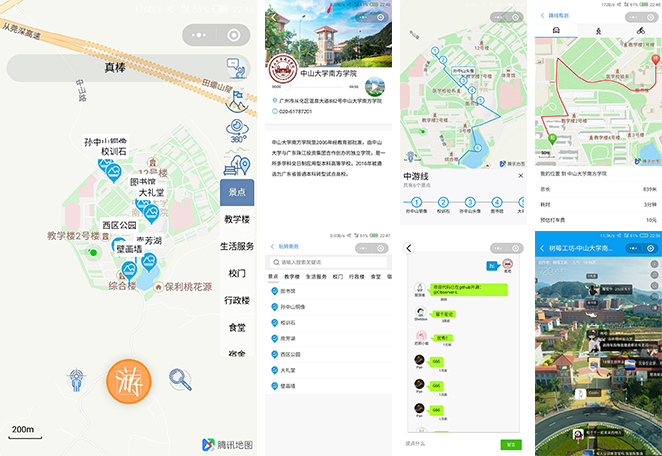

# 南苑导览

## 介绍

南苑导览是一款由学生（本人-_-）独立开发的以地图为载体，提供中山大学南方学院具体地点的**位置信息、导航、校园历史及文化介绍**的小程序。解决了校园导航标识不到位、地图形式低效单一、信息设计不够好的问题，**为来南苑参观游玩的人们提供更加完美的出行体验。**

----

## 功能特性：
* 景点分类动态展示
* 校园游玩路线推荐
* 景点特色信息一览
* 校园留言板说一说
* 校园全景（个人类小程序受限，暂未开放）
* TODO：与店铺、食堂合作，实现信息互联互通


## Demo



## 开发使用


## 使用说明

#### 安装（更新） wepy 命令行工具。

```console
npm install wepy-cli -g
```

#### 安装依赖

```console
cd myproject
npm install
```

#### 开发实时编译

```console
wepy build --watch
```

#### 开发者工具导入项目

使用`微信开发者工具`新建项目，本地开发选择项目根目录，会自动导入项目配置。

## 参与贡献

如果你有好的意见或建议，欢迎给我们提 Issues 或 Pull Requests，为优化「南苑导览」体验贡献力量。
小程序更新发展很快，个人精力有限，恐难以持续维护，欢迎有志者的参与和贡献，与我联系，期待你的加入。

## 参考资料

[小程序API文档](https://tencent.github.io/wepy/)

[wepy文档](https://tencent.github.io/wepy/document#/)

[玩转故宫 · 小程序](https://img.91ud.com/FgTgB47bc6dmAACekIjFxLO342mW/256)

[莞香广科 · 地图导览小程序](https://github.com/gxgk/school-map)


## 开源许可证
[License MIT](./LICENSE)

